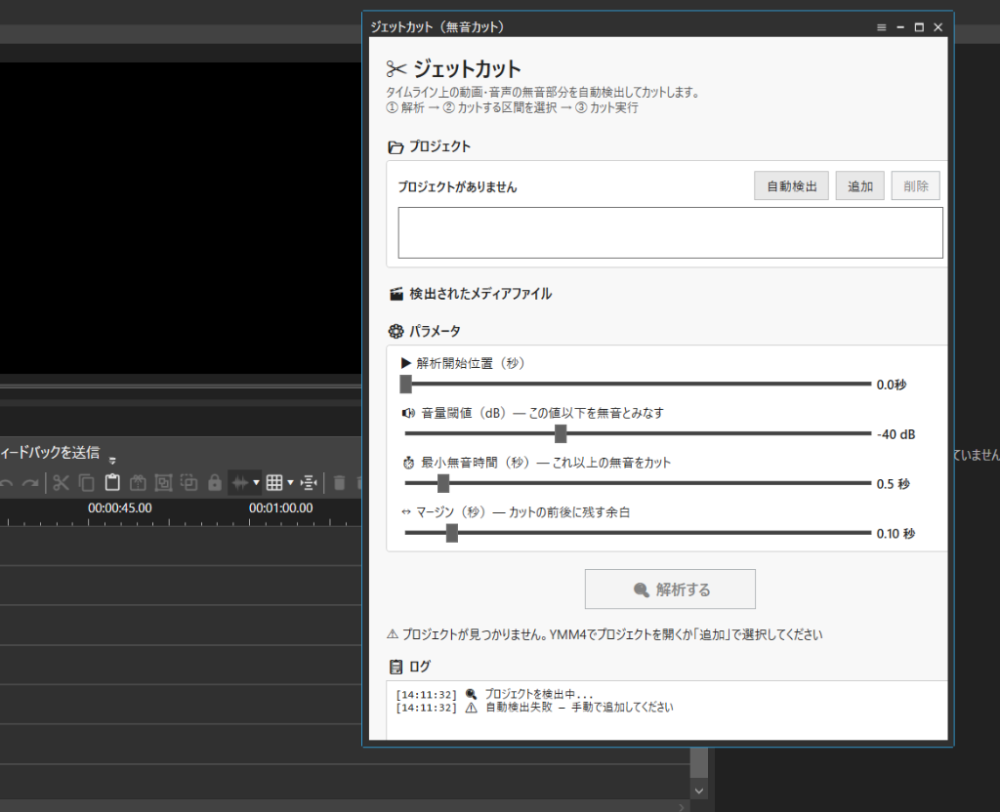

# YMM4 ジェットカットプラグイン

YMM4（ゆっくりMovieMaker4）用の**ジェットカット（無音カット）プラグイン**です。  
タイムライン上の動画・音声ファイルを解析し、無音区間を自動検出して選択的にカットできます。


## ✨ 機能

- 🔍 **無音区間の自動検出** — RMS音量解析で無音部分を自動的に検出
- ☑️ **選択的カット** — 検出された無音区間をチェックボックスで個別に選択/解除
- ⚙️ **パラメータ調整** — 音量閾値(dB)・最小無音時間・前後マージンをスライダーで設定
- 📂 **複数プロジェクト対応** — 現在のプロジェクトを自動検出 + 手動追加で複数ymmpを一括処理
- 📍 **再生位置から解析** — 指定した秒数以降だけを対象に解析可能
- 💾 **自動バックアップ** — カット実行前に `.ymmp.bak` を自動作成

## 📸 スクリーンショット



## 📥 インストール

### 方法1: 簡単インストール（推奨）

1. [Releases](../../releases) または [JetCutPlugin.ymme](./JetCutPlugin.ymme) をダウンロード
2. ダウンロードした `JetCutPlugin.ymme` をダブルクリック、またはYMM4のウィンドウにドラッグ＆ドロップ
3. YMM4を再起動

### 方法2: 手動インストール

1. `JetCutPlugin.dll` をダウンロード
2. YMM4フォルダの `user\plugin\JetCutPlugin\` を作成し、そこに配置
3. YMM4を再起動

### 方法2: ソースからビルド

```bash
git clone https://github.com/Rindai0123-Artifact/ymm4-jetcut-plugin.git
cd ymm4-jetcut-plugin/JetCutPlugin
dotnet build
```

> **前提条件**: [.NET 10 SDK](https://dotnet.microsoft.com/download) が必要です

#### ビルド設定

`Directory.Build.props` でYMM4のインストールパスを指定しています。  
環境に合わせて変更してください：

```xml
<Ymm4Dir>C:\YukkuriMovieMaker4_Lite</Ymm4Dir>
```

## 🚀 使い方

1. YMM4で動画プロジェクトを開く
2. **ツール** メニュー → **「ジェットカット（無音カット）」** を選択
3. プロジェクトとメディアファイルが自動検出される（手動追加も可能）
4. パラメータを調整：
   - **音量閾値**: この値(dB)以下を無音と判定（デフォルト: -40dB）
   - **最小無音時間**: この秒数以上の無音をカット対象に（デフォルト: 0.5秒）
   - **マージン**: カット前後に残す余白（デフォルト: 0.1秒）
5. **「🔍 解析する」** ボタンで無音区間を検出
6. リストでカットする区間を **チェックボックスで選択**
7. **「✂ カット実行」** で無音区間をカット
8. YMM4でプロジェクトを **再読み込み**

## 📋 パラメータガイド

| パラメータ | 範囲 | デフォルト | 説明 |
|---|---|---|---|
| 音量閾値 | -60 〜 0 dB | -40 dB | 小さい値 → より無音判定が厳しい |
| 最小無音時間 | 0.1 〜 5.0 秒 | 0.5 秒 | 短くすると細かい間もカット |
| マージン | 0 〜 1.0 秒 | 0.1 秒 | 大きくするとカット前後の余白が増える |
| 開始位置 | 0 〜 3600 秒 | 0 秒 | この秒数以降の無音のみを対象 |

## ⚠️ 注意事項

- カット実行後は **YMM4でプロジェクトを再読み込み** してください
- カット前に `.ymmp.bak` としてバックアップが自動作成されます
- 問題が発生した場合は `.bak` ファイルをリネームして復元できます
- YMM4 Lite / YMM4 どちらでも動作します

## 🛠️ 技術情報

- **対象**: YMM4 (ゆっくりMovieMaker4)
- **プラグイン種別**: IToolPlugin（ツールプラグイン）
- **フレームワーク**: .NET 10 / WPF
- **音声解析**: NAudio (YMM4同梱)
- **プロジェクト操作**: ymmpファイル (JSON) 直接編集

### ファイル構成

```
JetCutPlugin/
├── JetCutPlugin.csproj        # プロジェクト定義
├── Directory.Build.props       # YMM4パス設定
├── JetCutToolPlugin.cs         # IToolPlugin 登録
├── JetCutViewModel.cs          # MVVM ViewModel
├── JetCutView.xaml / .xaml.cs  # WPF UI
├── AudioAnalyzer.cs            # RMS音量解析エンジン
├── YmmpEditor.cs               # ymmpファイル操作
├── ProjectDetector.cs          # プロジェクト自動検出
└── SilentRegionItem.cs         # 無音区間モデル
```

## 📄 ライセンス

[MIT License](LICENSE)

## 🤝 コントリビューション

Issue・Pull Request 大歓迎です！
